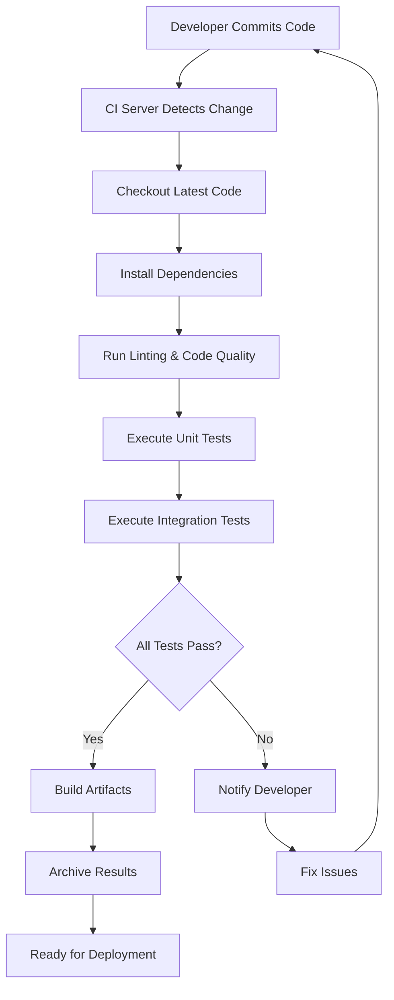
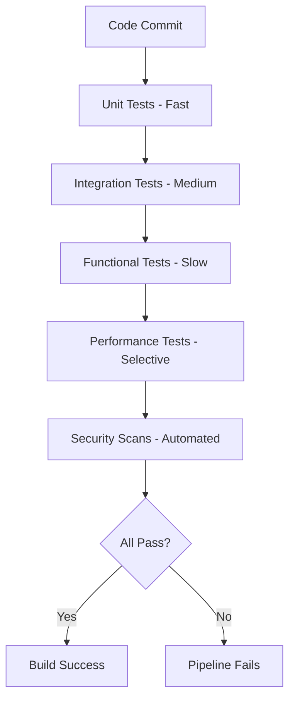

# Continuous Integration (CI) with Python

A practical implementation demonstrating Continuous Integration concepts and workflows using Python.

## What is Continuous Integration?

**Continuous Integration (CI)** is a software development practice where developers regularly merge code changes into a central repository. Each integration is automatically verified through automated builds and tests, enabling early detection of integration errors.

### Key Principles

| Principle | Description |
|-----------|-------------|
| **Frequent Integration** | Developers commit code multiple times daily |
| **Automated Testing** | Every commit triggers automated test suites |
| **Fast Feedback** | Quick notification of build/test failures |
| **Shared Repository** | Single source of truth for all code |
| **Build Automation** | Consistent, repeatable build process |

## CI Workflow



## Project Structure

```
ci-python-project/
├── src/
│   ├── __init__.py
│   ├── calculator.py
│   └── utils.py
├── tests/
│   ├── __init__.py
│   ├── test_calculator.py
│   └── test_utils.py
├── .github/
│   └── workflows/
│       └── ci.yml
├── requirements.txt
├── requirements-dev.txt
├── setup.py
├── .gitignore
└── README.md
```

## CI Pipeline Stages

### 1. Code Quality Checks
- **Linting**: `flake8` for code style enforcement
- **Formatting**: `black` for consistent code formatting
- **Type Checking**: `mypy` for static type analysis

### 2. Testing Phases

#### Types of Tests in CI

| Test Type | Scope | Purpose | Example |
|-----------|-------|---------|---------|
| **Unit Tests** | Single functions/classes | Verify individual components work correctly | Testing `add(2, 3) == 5` |
| **Integration Tests** | Multiple components | Ensure components work together | Database + API interaction |
| **Functional Tests** | End-to-end features | Validate business requirements | User login workflow |
| **Smoke Tests** | Critical paths | Quick verification after deployment | Basic app functionality |
| **Performance Tests** | System performance | Check response times and throughput | API response < 200ms |
| **Security Tests** | Vulnerability scanning | Identify security flaws | SQL injection, XSS testing |

#### Testing Strategy



#### Test Execution Levels
- **Unit Tests**: Run on every commit (~seconds)
- **Integration Tests**: Run on feature branch merges (~minutes)  
- **End-to-End Tests**: Run on release candidates (~hours)
- **Performance Tests**: Run nightly or on staging
- **Security Tests**: Continuous monitoring + release gates

### 3. Build Verification
- **Dependency Installation**: Verify all requirements
- **Import Testing**: Ensure modules import correctly
- **Package Building**: Create distributable packages

## CI Configuration Example (GitHub Actions)

```yaml
name: CI Pipeline

on:
  push:
    branches: [ main, develop ]
  pull_request:
    branches: [ main ]

jobs:
  test:
    runs-on: ubuntu-latest
    strategy:
      matrix:
        python-version: [3.8, 3.9, 3.10, 3.11]
    
    steps:
    - uses: actions/checkout@v3
    - name: Set up Python
      uses: actions/setup-python@v3
      with:
        python-version: ${{ matrix.python-version }}
    
    - name: Install dependencies
      run: |
        pip install -r requirements-dev.txt
    
    - name: Lint with flake8
      run: flake8 src/ tests/
    
    - name: Test with pytest
      run: pytest tests/ --cov=src/
```

## Benefits of CI Implementation

- **Early Bug Detection**: Issues caught before reaching production
- **Reduced Integration Risk**: Smaller, frequent changes easier to debug  
- **Improved Code Quality**: Automated quality checks on every commit
- **Faster Development**: Quick feedback loop for developers
- **Consistent Builds**: Standardized build environment

## Getting Started

1. **Clone the repository**
   ```bash
   git clone <repository-url>
   cd ci-python-project
   ```

2. **Set up development environment**
   ```bash
   python -m venv venv
   source venv/bin/activate  # On Windows: venv\Scripts\activate
   pip install -r requirements-dev.txt
   ```

3. **Run tests locally**
   ```bash
   pytest tests/ --cov=src/
   ```

4. **Check code quality**
   ```bash
   flake8 src/ tests/
   black --check src/ tests/
   ```

## CI Best Practices Implemented

- **Fast Builds**: Optimized for quick feedback (< 10 minutes)
- **Fail Fast**: Stop pipeline on first failure
- **Matrix Testing**: Multiple Python versions
- **Caching**: Dependencies cached between runs
- **Parallel Execution**: Tests run concurrently where possible

## Tools & Technologies

| Tool | Purpose |
|------|---------|
| **GitHub Actions** | CI/CD Platform |
| **pytest** | Testing Framework |
| **flake8** | Code Linting |
| **black** | Code Formatting |
| **coverage.py** | Code Coverage |
| **mypy** | Static Type Checking |

---

*This repository demonstrates CI fundamentals - automated testing, code quality checks, and continuous feedback loops that form the foundation of modern software development practices.*
